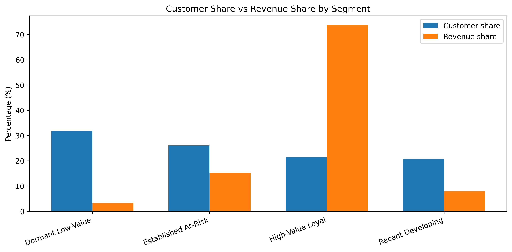
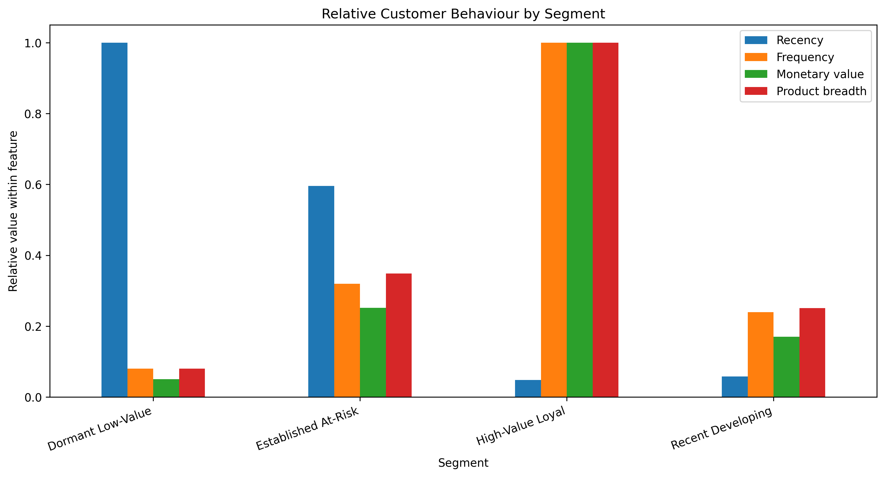
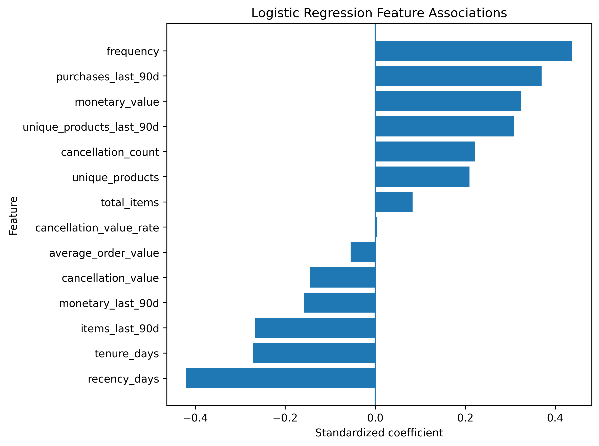
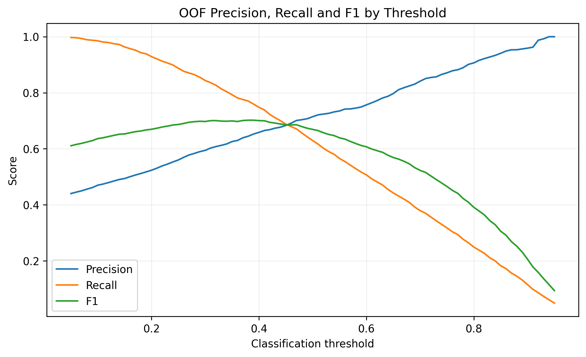
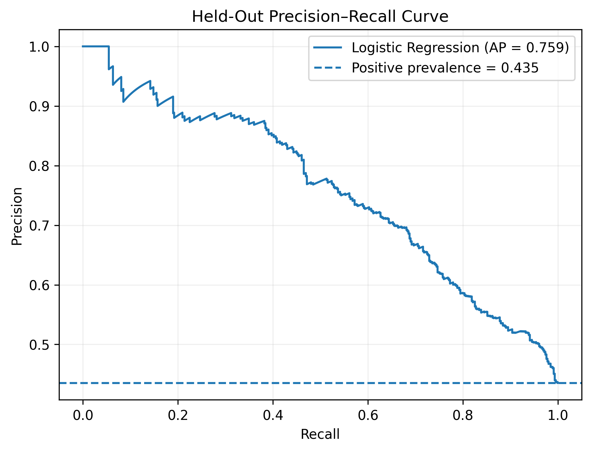

# Customer Value Segmentation & 90-Day Repeat-Purchase Propensity

A customer analytics project using the **UCI Online Retail II** transaction
dataset to answer two related business questions:

1. **What types of customers exist in the customer base?**
2. **Which existing customers are most likely to purchase again within the next 90 days?**

The project combines customer segmentation with supervised propensity modelling.
It covers data ingestion, transaction cleaning, customer-level feature
engineering, K-Means clustering, time-aware target construction, model
comparison, threshold selection and held-out evaluation.

The two analyses use different time frames. Segmentation uses the complete
observation period to describe customer behaviour, while the propensity model
uses a historical cutoff so that predictors contain only information that would
have been available at prediction time.

---

## Key results

### Customer segmentation

K-Means clustering identified four interpretable customer groups:

- **High-Value Loyal**
- **Established At-Risk**
- **Recent Developing**
- **Dormant Low-Value**

The **High-Value Loyal** segment contains approximately **21.4% of customers**
but accounts for **73.7% of historical merchandise revenue**.

### 90-day repeat-purchase propensity

Three classifiers were compared using five-fold stratified cross-validation:

- Logistic Regression
- Random Forest
- Histogram Gradient Boosting

Logistic Regression produced the strongest validation results and was retained
as the final model.

On the previously untouched held-out test population:

| Metric | Result |
|---|---:|
| ROC-AUC | **0.786** |
| Average Precision | **0.759** |
| Precision | **0.646** |
| Recall | **0.729** |
| F1 score | **0.685** |
| Accuracy | **0.708** |
| Brier score | **0.184** |

Using the pre-selected operating threshold of **0.40**, the model classified
approximately **49% of customers** as likely repeat purchasers while capturing
approximately **73% of customers who actually purchased again** during the
following 90 days.

---

## Analytical workflow

```text
UCI Online Retail II
        │
        ▼
01 — Data ingestion
        │
        ▼
online_retail_raw.parquet
        │
        ▼
02 — Transaction cleaning
        │
        ▼
online_retail_clean.parquet
        │
        ├─────────────────────────────────────┐
        │                                     │
        ▼                                     ▼
03 — Customer feature                 05 — Point-in-time
     engineering                           propensity dataset
        │                                     │
        ▼                                     ▼
04 — Customer segmentation           06 — Propensity modelling
        │                                     │
        └──────────────────┬──────────────────┘
                           ▼
                 Business decision framework
```

---

## Data and transaction cleaning

The original Online Retail II workbook contains **1,067,371 transaction rows**
across two yearly worksheets.

Transaction quality was investigated before deciding which records should be
retained or removed.

Some of the main findings were:

- customer IDs missing from an invoice could not be recovered from other lines
  belonging to the same invoice;
- missing descriptions occurred only on anonymous, zero-price rows and were not
  required for the customer-level objectives;
- exact duplicate rows could not safely be classified as errors because the
  dataset does not contain a line-item identifier and repeated lines may
  represent legitimate transaction recording;
- removing all exact duplicates would change total recorded revenue by only
  about **0.29%**, but could materially alter individual customer quantities and
  values;
- negative-quantity transactions without a cancellation invoice prefix were
  anonymous, zero-price inventory/accounting adjustments rather than identifiable
  customer returns;
- identifiable `C`-prefixed negative transactions were retained separately as
  customer cancellation behaviour;
- zero- and negative-price accounting lines and explicit non-merchandise charges
  were excluded from merchandise purchase behaviour.

A valid purchase was defined as an identifiable customer transaction with:

- positive quantity;
- positive price;
- a non-cancellation invoice;
- and a merchandise stock code.

The resulting cleaned transaction dataset contains **820,506 customer-level
eligible purchase and cancellation rows**.

---

## Customer feature engineering

Customer behaviour was aggregated from transaction level to customer level.

Core features included:

- recency;
- purchase frequency;
- historical monetary value;
- total purchased quantity;
- product breadth;
- average order value;
- average items per order;
- observed customer tenure;
- cancellation count;
- cancellation value;
- cancellation-value rate;
- and net merchandise value.

The full feature set was retained for profiling. A smaller, less redundant
subset was selected as clustering input.

---

## Customer segmentation

### Clustering features

The final clustering input consisted of:

- `recency_days`
- `frequency`
- `monetary_value`
- `unique_products`

Purchase frequency, monetary value and product breadth were strongly
right-skewed, so `log1p` transformation was applied before standardization.

Cancellation behaviour, tenure, average order value and other engineered
variables remained available for interpreting the resulting segments but were
not used directly to determine cluster membership.

### Selecting the number of clusters

Candidate K-Means solutions from `k = 2` to `k = 10` were evaluated using:

- inertia;
- silhouette score;
- cluster balance;
- and business interpretability.

Although `k = 2` produced the highest silhouette score, it created a relatively
coarse division of the customer population.

The `k = 3` and `k = 4` solutions had very similar silhouette performance, while
the four-cluster solution added a useful lifecycle distinction between recent
developing customers and longer-established customers showing signs of
inactivity.

The final model uses **four clusters**.

### Final customer segments

| Segment | Customer share | Revenue share | Interpretation |
|---|---:|---:|---|
| **High-Value Loyal** | 21.4% | 73.7% | Highly active, frequent and high-value customers |
| **Established At-Risk** | 26.1% | 15.1% | Long-standing customers with meaningful historical value but weak recent activity |
| **Recent Developing** | 20.7% | 8.0% | Recently active customers with emerging value and growth potential |
| **Dormant Low-Value** | 31.8% | 3.2% | Infrequent, low-value customers with long purchase recency |



The revenue concentration shows why customer count alone is not enough to
measure commercial importance: fewer than one quarter of customers account for
almost three quarters of historical merchandise revenue.



### Business interpretation

**High-Value Loyal** customers are the main retention priority. Their relatively
small customer share contributes the majority of historical revenue.

**Established At-Risk** customers have meaningful historical value and longer
relationships but much weaker recency. They are good candidates for selective
reactivation or win-back activity.

**Recent Developing** customers are currently active but have not yet accumulated
the purchasing history of the high-value group. Cross-selling, relevant product
recommendations and encouraging the next purchase may help develop these
relationships.

**Dormant Low-Value** customers represent the largest segment by customer count
but contribute little revenue. Low-cost automated engagement is likely more
appropriate than expensive incentives for the group as a whole.

---

## 90-day repeat-purchase propensity

### Temporal prediction design

Predictive modelling requires a clear separation between historical information
and future customer behaviour.

A historical cutoff of **9 September 2011** was established.

- **Historical feature period:** transactions observed on or before the cutoff
- **Prediction window:** the following 90 calendar days
- **Target:** whether the customer makes at least one valid merchandise purchase
  during that future period

Only customers with at least one valid purchase before the cutoff were eligible
for prediction.

The resulting modelling population contains **5,256 existing customers**:

- **2,287 repeat purchasers — 43.51%**
- **2,969 non-repeat purchasers — 56.49%**

All predictors were constructed strictly from pre-cutoff information.

### Predictors

The propensity dataset combines three views of customer behaviour.

**Long-term purchasing behaviour**

- recency;
- purchase frequency;
- monetary value;
- purchased quantity;
- product breadth;
- average order value;
- and observed tenure.

**Recent 90-day momentum**

- purchases during the previous 90 days;
- recent monetary value;
- recent purchased quantity;
- and recent product breadth.

**Historical cancellation behaviour**

- cancellation count;
- cancellation value;
- and cancellation-value rate.

The recent-activity variables are intentionally sparse: at least half of eligible
customers made no purchase during the 90 days immediately preceding the cutoff.

---

## Model development

A stratified 80/20 customer-level train/test split was created.

The held-out test population was not used for candidate-model comparison or
threshold selection.

A dummy classifier established the minimum benchmark. Because the non-repeat
class is slightly larger, a majority-class classifier can achieve approximately
56.5% accuracy while identifying no repeat purchasers. This shows why accuracy
alone is not sufficient for this problem.

### Logistic Regression preprocessing

Strongly right-skewed monetary, quantity, frequency and cancellation predictors
were transformed using `log1p` and standardized.

Recency and observed tenure showed much milder skew and were standardized
without logarithmic transformation.

All preprocessing was contained inside a scikit-learn pipeline so that
transformations were fitted separately within each cross-validation training
fold.

### Model comparison

| Model | Accuracy | Precision | Recall | F1 | ROC-AUC | Average Precision |
|---|---:|---:|---:|---:|---:|---:|
| **Logistic Regression** | **0.729** | **0.714** | **0.629** | **0.669** | **0.799** | **0.771** |
| Random Forest | 0.718 | 0.698 | 0.623 | 0.658 | 0.789 | 0.761 |
| Histogram Gradient Boosting | 0.721 | 0.702 | 0.624 | 0.660 | 0.784 | 0.755 |

The nonlinear models did not improve predictive performance.

Logistic Regression was retained because it combined the strongest
cross-validated performance with greater simplicity and interpretability.

---

## Model interpretation

The standardized Logistic Regression coefficients suggest that the strongest
predictive signals are related to:

- historical purchase frequency;
- purchase recency;
- recent purchase activity;
- historical customer value;
- and recent product breadth.



Positive coefficients are associated with higher predicted repeat-purchase
propensity, while negative coefficients are associated with lower propensity,
holding the other predictors constant.

Several behavioural variables contain overlapping information. Individual
coefficients are therefore interpreted as conditional predictive associations
rather than causal effects.

The complete coefficient table is available in:

`reports/tables/logistic_coefficients.csv`

---

## Operating-threshold selection

The default probability threshold of 0.50 was not assumed to be the appropriate
decision rule.

Threshold selection was performed using **out-of-fold probabilities from the
training population only**.

The maximum observed OOF F1 score occurred near **0.39**. A rounded threshold of
**0.40** was selected because it produced virtually identical performance while
providing a simpler decision rule.



At the selected threshold, approximately half of customers are classified as
likely repeat purchasers.

---

## Final held-out evaluation

After model and threshold selection were completed, the Logistic Regression
pipeline was fitted using the complete training population and evaluated once
on the held-out test customers.

The held-out ROC-AUC was **0.786**, compared with approximately **0.798**
out-of-fold, while Average Precision was **0.759**, compared with approximately
**0.770** out-of-fold.

The relatively small difference suggests that performance carries over
reasonably well to customers not involved in model development.

At the selected threshold of 0.40:

- **517 of 1,052 customers (49.1%)** were classified as likely repeat purchasers;
- **334 of 458 actual repeat purchasers (72.9%)** were captured;
- **64.6% of targeted customers** actually purchased again.



The held-out Brier score was **0.184**, compared with roughly **0.246** from
predicting the same repeat-purchase prevalence for every customer.

This suggests that the predicted probabilities contain useful information beyond
the overall repeat-purchase rate. A dedicated calibration analysis would still
be needed before treating them as precisely calibrated purchase probabilities.

---

## Integrated business use case

The project addresses two complementary customer-analytics questions.

### Customer segmentation — who are our customers?

Segmentation provides a broader view of the customer base and helps determine
the type of treatment or engagement that may be appropriate for different
behavioural groups.

### Repeat-purchase propensity — who is likely to buy again soon?

The supervised model estimates the probability that an existing customer will
make another valid merchandise purchase within the following 90 days.

It provides an additional prioritization layer for deciding which customers
should receive attention first.

### Combined decision logic

In practice, segmentation and propensity could be calculated at the same
scoring date and used together.

The segment would help determine **how a customer should be treated**, while the
propensity score would help determine **how strongly or urgently that customer
should be prioritized**.

| Customer segment | Higher repeat-purchase propensity | Lower repeat-purchase propensity |
|---|---|---|
| **High-Value Loyal** | Protect and personalize; prioritize retention and relevant offers | Proactive retention attention because a valuable customer may be cooling |
| **Established At-Risk** | Timely reactivation; the customer still appears receptive | Selective stronger win-back effort based on historical value |
| **Recent Developing** | Nurture, cross-sell and encourage the next purchase | Light engagement and onboarding rather than expensive incentives |
| **Dormant Low-Value** | Low-cost reactivation may still be worthwhile | Lowest priority; avoid costly intervention |

This table is a proposed decision framework rather than a measured segment-level
propensity result.

The current segmentation and propensity outputs are not merged directly because
they were produced using different historical reference dates. The segmentation
uses the complete observation period, while the propensity model represents
customer behaviour at the earlier September 2011 cutoff.

In practice, both would need to be calculated using the same scoring date.

---

## Repository structure

```text
customer-segmentation-purchase-propensity/
│
├── README.md
├── requirements.txt
├── .gitignore
├── LICENSE
│
├── notebooks/
│   ├── 01_data_ingestion.ipynb
│   ├── 02_data_cleaning.ipynb
│   ├── 03_customer_feature_engineering.ipynb
│   ├── 04_customer_segmentation.ipynb
│   ├── 05_propensity_dataset.ipynb
│   └── 06_repeat_purchase_model.ipynb
│
├── data/
│   ├── README.md
│   ├── raw/
│   │   └── .gitkeep
│   ├── interim/
│   │   └── online_retail_raw.parquet
│   └── processed/
│       ├── online_retail_clean.parquet
│       ├── customer_features.parquet
│       ├── customer_segments.parquet
│       ├── propensity_dataset.parquet
│       └── test_customer_propensity_scores.parquet
│
└── reports/
    ├── figures/
    │   ├── kmeans_inertia_by_k.png
    │   ├── kmeans_silhouette_by_k.png
    │   ├── segment_customer_vs_revenue_share.png
    │   ├── segment_relative_behavior.png
    │   ├── logistic_coefficients.png
    │   ├── oof_threshold_precision_recall_f1.png
    │   ├── heldout_roc_curve.png
    │   └── heldout_precision_recall_curve.png
    │
    └── tables/
        ├── kmeans_candidate_evaluation.csv
        ├── segment_business_summary.csv
        ├── model_comparison.csv
        ├── logistic_coefficients.csv
        ├── threshold_comparison.csv
        ├── final_test_metrics.csv
        └── final_confusion_matrix.csv
```

---

## Notebooks

| Notebook | Purpose |
|---|---|
| `01_data_ingestion.ipynb` | Downloads the original UCI dataset, combines the two yearly worksheets and writes the raw Parquet artifact |
| `02_data_cleaning.ipynb` | Investigates missingness, duplicates, cancellations, price validity and non-merchandise activity before constructing the cleaned transaction dataset |
| `03_customer_feature_engineering.ipynb` | Builds customer-level behavioural and cancellation features for segmentation |
| `04_customer_segmentation.ipynb` | Selects clustering features, evaluates candidate K-Means solutions and interprets the final four customer segments |
| `05_propensity_dataset.ipynb` | Creates the historical cutoff, point-in-time customer predictors and 90-day repeat-purchase target |
| `06_repeat_purchase_model.ipynb` | Compares classification models, interprets Logistic Regression, selects the operating threshold and evaluates the final model on held-out customers |

---

## Reproducibility

The full pipeline can be reproduced from the original public dataset.

### 1. Clone the repository

```bash
git clone https://github.com/apostolis-bloutsos-data/customer-segmentation-purchase-propensity.git
cd customer-segmentation-purchase-propensity
```

### 2. Install dependencies

```bash
pip install -r requirements.txt
```

### 3. Run the notebooks in order

```text
01 → 02 → 03 → 04 → 05 → 06
```

Notebook 01 retrieves the original Online Retail II workbook directly from UCI.

Subsequent notebooks first look for the required upstream Parquet artifact
locally. If it is unavailable, they can retrieve the corresponding committed
artifact from the GitHub repository.

The original Excel workbook is intentionally not stored in version control.

---

## Main output artifacts

### Processed data

- `customer_features.parquet` — customer-level segmentation features
- `customer_segments.parquet` — final customer segment assignments
- `propensity_dataset.parquet` — point-in-time predictors and 90-day target
- `test_customer_propensity_scores.parquet` — held-out customer probabilities,
  classifications and historical outcomes

### Reporting tables

- `kmeans_candidate_evaluation.csv`
- `segment_business_summary.csv`
- `model_comparison.csv`
- `logistic_coefficients.csv`
- `threshold_comparison.csv`
- `final_test_metrics.csv`
- `final_confusion_matrix.csv`

---

## Limitations

**Single retailer and historical period.**  
The analysis is based on one retailer and a dataset covering 2009–2011.
Behavioural patterns and model performance should not be assumed to transfer
unchanged to another retailer or period.

**Single propensity cutoff.**  
The predictive evaluation uses one historical cutoff and one subsequent
90-day prediction window. A stronger assessment would repeat the experiment
across several historical cutoffs.

**Cluster stability over time.**  
The segmentation describes behaviour over the available observation period.
Cluster definitions and customer membership may change as purchasing behaviour
changes.

**Threshold economics.**  
The 0.40 operating threshold was selected from the statistical precision-recall
trade-off because campaign costs and customer-level economic values were not
available. In practice, the costs and benefits of customer contact should also
inform the threshold.

**Predictive rather than causal interpretation.**  
Model coefficients describe associations useful for prediction. They do not
show that changing a particular customer behaviour would cause a change in
future purchasing.

**Temporal alignment of segmentation and propensity.**  
The current segmentation and propensity outputs use different historical
reference dates and are therefore not directly combined at customer level.
Using them together would require both to be recalculated using the same scoring
date.

---

## Possible extensions

Possible next steps include:

- repeated temporal backtesting across several historical cutoffs;
- probability calibration analysis;
- customer-value or campaign-cost-aware threshold optimization;
- point-in-time segmentation aligned with the propensity scoring date;
- monitoring segment migration over time;
- incorporating customer value into targeting decisions rather than treating
  every repeat purchase as economically equivalent.

---

## Technologies

- Python
- pandas
- NumPy
- scikit-learn
- Matplotlib
- Requests
- PyArrow
- openpyxl
- Jupyter / Google Colab

---

## License

The code in this repository is available under the [MIT License](LICENSE).

The Online Retail II dataset is provided by the UCI Machine Learning Repository
and remains subject to the terms of its original source.

---

## Data source

**UCI Machine Learning Repository — Online Retail II**

Chen, D. (2012). *Online Retail II* [Dataset].  
DOI: `10.24432/C5CG6D`

The source dataset is licensed under **CC BY 4.0**. The Parquet datasets
included in this repository are derived from the original UCI data.
